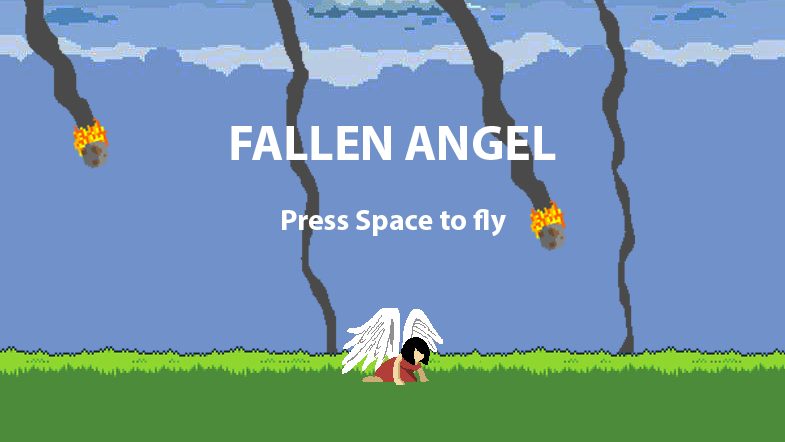
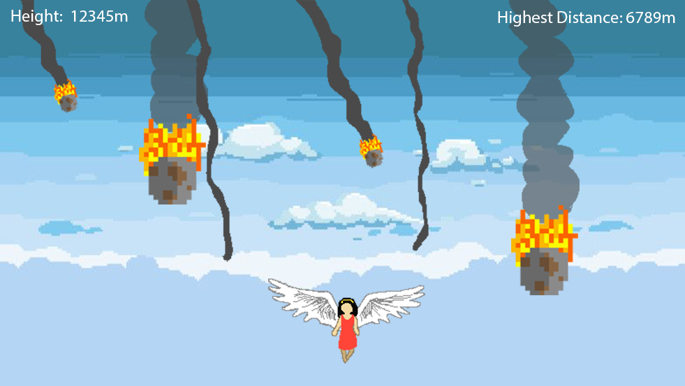

# Fallen Angel

## I. High Concept
The user plays as an angel that has fallen to the Earth as meteors hurdle towards them. The only way back to the heavens is by flying straight through the meteor shower while dodging blazing meteors or performing powerful spin-attacks to break through.

## II. Genre
Action, Casual, Shoot-em-up.

## III. Platform
Desktop only (for now, but may be mobile-friendly later on).

## IV. Story
Theme: Perseverence
Mood: excited, determined, awed, exhilarated
Narrative: Keep flying while dodging and breaking through falling meteors
Premise: If you crash-land, get back up and try again.
Player motivation: Fly as high as you can while destroying as many meteors before they destroy the Earth.

## V. Esthetics
Graphics style - Vector or pixel art with saturated colors.
Sound - 8-bit/pixel-style sound effects applied to movement and actions (i.e.: sound of meteors being destroyed, sound of flapping wings).

## VI. Gameplay
### Mechanics
Player can perform dodge-rolls and spin-attacks
### Control
* Keyboard only (arrow keys and spacebar).
* Use Left and Right arrows to move.
* Double tap Left or Right arrow keys to perform dodge-rolls.
* Use Spacebar to perform spin-attacks.
### Teaching the game
Instructions will be displayed next to the game canvas.
### Player learning
Spamming dodge-rolls and spin-attacks will not work later on in the game. As the player flies higher, more meteors will whizz by. Since there will be a cooldown time applied to dodge-rolls and spin-attacks, the user must estimate the best time and position to utilize the different mechanics and avoid getting hit.

## VII. Screenshots

## VIII. Other
The art will mostly be hand-drawn on Photoshop, with the exception of background art.
Inspiration was drawn from Video Game High School, a webseries uploaded by the YouTube channel RocketJump. There is a scene in one of the episodes where a character creates a game that has an angel dodging meteors. I always thought that game looked very esthetically pleasing, and since the game was never actually created, I wish to bring this game to life.

## IX. About the developer
The name's Rachel. I am a Game Design and Development student and I enjoy bringing things to life with C# and Unity, with the occasional assistance from more visual oriented software such as Photoshop and FireAlpaca (its website looks sketchy, but the software itself is free and very user-friendly. Would highly recommend for amateur artists).
